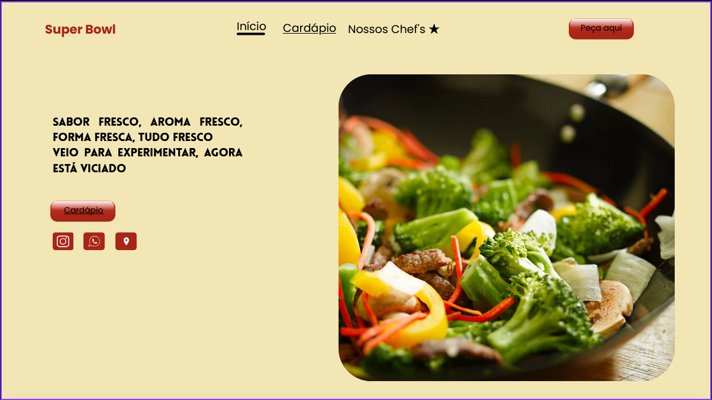

BRIEFING

<h3> Definição do tema: </h2>
    

        Desenvolvimento de código de restaurante que tenha todos os pratos e os preços, peça o endereço, conte o valor total e pergunte se o pagamento vai ser em dinheiro, cartão ou na hora, e confirme tudo, agradecendo pela compra ao final.

<h3> Especificação do tipo de serviço ou produto: </h3>
    

        Área de alimentação, projeto de site de restaurante com design feito nas cores vermelho e amarelo.

<h3> Objetivos principais: </h3>
    

        * tela de inicio (contendo menu, pratos, principais chefs, link para tela de "saiba mais").
        * tela de cardápio (contendo todos os pratos, preços, descrição).
        * tela de pagamento (contendo opções de pagamento, endereço, valor total).
        * tela de chef's (contendo informações sobre os principais chef's do restaurante e seus pratos).
        * tela de confirmação (contendo agradecimento pela compra, valor total).

<h3>Objetivos específicos:</h3>
    

        * tela de inicio: mostra o sumário inicial (contendo nome do site e link para aba de "cardápio", partes de "chefs" e "saiba mais"). E o cliente poderá entrar no site e escolher aonde navegar.
        * tela de cardápio: contém o cardápio (com pratos, preços e descrição de cada prato).
        * tela de chef's: mostra foto de cara chef e pratos que eles criaram anteriormente.
        * tela de pagamento: contém as opções de pagamento (com opções de dinheiro, cartão/pagamento na entrega e pix).
        * tela de confirmação: contém a confirmação da compra (com valor total, confirmação do método de pagamento e do endereço).

<h3> Público alvo do projeto: </h3>
    

        Stays <3

<h3> Principal diferencial: </h3>
    

        
        O nome dos pratos!!

<h3> Metodologia proposta de desenvolvimento pratico: </h3>
    

        O projeto foca principalmente no desenvolvimento web, utilizando HTML, CSS e JavaScript para fazerem as partes de, consecutivamente, a parte frontal com design primeiramente rascunhado no figma, aplicação de design arrumado para deixar o site bonito e arrumar todos os detalhes,  epor último o javascript para terminar a parte funcional do código.

<h3> resultados esperados: </h3>
    

        Apenas de desenvolvimento profissional, pretendendo fazer um site evoluindo assim nas linguagens citadas anteriormente.

<h3> Protótipo inicial do site!</h3>

